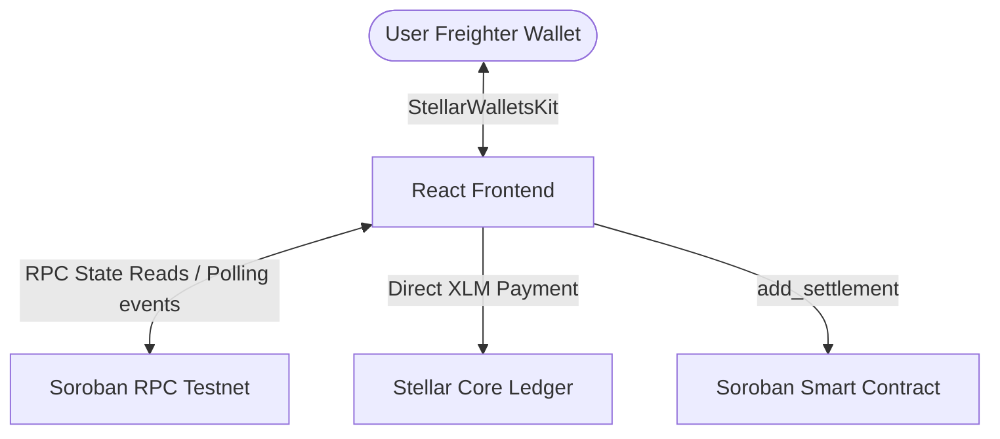

# DevD — Splitwise × Stellar × Web3

**DevD** is a modern, production-grade expense-sharing platform built specifically for developer squads, hackathon teams, and startups. It removes the pain of calculating and settling shared costs (like subscriptions, servers, travel, and meals) by allowing users to log expenses and settle up instantly using Stellar (XLM) on-chain payments.

DevD is designed with a premium startup aesthetic, utilizing dark mode, sleek glassmorphism, responsive cards, and micro-animations.

---

## Live Demo & Contracts

*   **Live Demo URL:** [DevD Web App (Vercel)](https://devd-stellar.vercel.app)
*   **Smart Contract Address:** `CDKCOKAMDDJIXHFTTVUY5GJPZRCC5645NKZ544WPI253RMYFXFH7T4KI`
*   **Stellar Laboratory Contract Link:** [Stellar Lab (Testnet)](https://lab.stellar.org/r/testnet/contract/CDKCOKAMDDJIXHFTTVUY5GJPZRCC5645NKZ544WPI253RMYFXFH7T4KI)
*   **Deployment Transaction Hash:** `f67a7e4c5e118243dbf7bd9bbfc2eeae425ac919acbd883608a8ec7f52fecb40`
*   **Explorer Link:** [Stellar.Expert (Testnet)](https://stellar.expert/explorer/testnet/tx/f67a7e4c5e118243dbf7bd9bbfc2eeae425ac919acbd883608a8ec7f52fecb40)

### Screenshots

| Wallet Connected | Balance Display |
| :---: | :---: |
|  |  |

| Successful Transaction | Transaction Feedback |
| :---: | :---: |
|  |  |

---

## Key Features

1.  **Stellar Wallet Integration**: Seamless Freighter Wallet connection on Stellar Testnet, displaying balances and handles connection states.
2.  **On-Chain Registry**: All groups, member logs, expenses, and settlement records are registered on-chain in a Soroban smart contract.
3.  **Splitwise Debt Consolidation**: DevD consolidates balances using an optimal debt simplification algorithm. It determines the minimum transactions required to settle all group debts.
4.  **Instant Settle-Up Workflow**: Tapping "Settle Up" triggers a native Stellar XLM transfer. Once confirmed, it automatically calls the smart contract to register the receipt with the payment transaction hash.
5.  **Real-Time Event Listener**: Utilizes a background polling listener to subscribe to contract events (`group_cre`, `mbr_add`, `exp_add`, `set_add`), instantly synchronizing UI state for all users.
6.  **Premium Startup UI**: Beautifully designed Dark Mode layout built with Tailwind CSS, Framer Motion, and Lucide Icons. Features responsive lists, loading skeletons, and interactive graphs.

---

## Technical Architecture



### Flow description:
1.  **Connect Wallet**: The user logs in via Freighter using the static `StellarWalletsKit` API.
2.  **Add Expense**: Payer submits details to the contract. The contract emits `exp_add` event.
3.  **Simplification**: The frontend fetches expenses, computes net balances, and runs the Splitwise consolidation algorithm.
4.  **Settle up**: User clicks Settle. The frontend builds a native payment operation, requests a Freighter signature, and broadcasts it to Horizon. It then calls `add_settlement` on the Soroban contract using the Horizon transaction hash.

---

## Folder Structure

```text
├── contract/                       # Soroban Smart Contract
│   ├── Cargo.toml                  # Rust cargo configuration
│   └── src/
│       ├── lib.rs                  # Smart contract logic & entrypoint
│       └── test.rs                 # Unit tests (Mock auth, state checks)
├── src/                            # React Frontend
│   ├── assets/                     # Scaffolding resources
│   ├── components/                 # React UI Components
│   │   ├── AddExpenseModal.tsx     # Split equal/custom selector
│   │   ├── ContractProvider.tsx    # Soroban RPC client & Event Poller
│   │   ├── CreateGroupModal.tsx    # Modal to register new workspace
│   │   ├── Dashboard.tsx           # Stat summaries & Workspaces grid
│   │   ├── GroupDetails.tsx        # Member lists, timeline, settlement graph
│   │   ├── Navbar.tsx              # Connection stats, address, XLM balance
│   │   ├── SettleUpModal.tsx       # Native Horizon transfers & contract logs
│   │   └── WalletProvider.tsx      # Freighter Wallet context wrapper
│   ├── contracts/                  # Generated TypeScript client bindings
│   │   └── devd/
│   ├── utils/                      # Core utility functions
│   │   └── settlement.ts           # Splitwise balance consolidation logic
│   ├── App.tsx                     # Main router and landing page
│   ├── index.css                   # Custom stylesheets & glassmorphism themes
│   └── main.tsx                    # React mounting entrypoint
├── package.json                    # Workspace npm package definitions
├── tsconfig.json                   # TypeScript compiler configuration
└── vite.config.ts                  # Vite bundler plugins (Tailwind CSS)
```

---

## Smart Contract Explanation

The smart contract is written in Rust using `soroban-sdk` and deployed to Stellar Testnet. 

### Data Storage Strategy
To prevent ledger state bloat and save gas, DevD avoids huge nested arrays. Instead, it stores records under granular keys:
*   `GroupCount` and `Group(u64)`: Global counter and individual group structs.
*   `ExpenseCount` and `Expense(u64)`: Global counter and individual expense details.
*   `SettlementCount` and `Settlement(u64)`: Global counter and individual settlement receipts.
*   `GroupExpenses(u64)` / `GroupSettlements(u64)`: Vec of IDs associated with a group.
*   `UserGroups(Address)`: Vec of Group IDs a user wallet belongs to.

---

## Installation & Setup

### Prerequisites
1.  Node.js (v18+)
2.  Rust & Cargo (for smart contract edits)
3.  Freighter Wallet extension installed in your browser (configured for Testnet)

### 1. Clone the project and install dependencies
```bash
npm install
```

### 2. Compile and test the smart contract
```bash
cd contract
cargo test
stellar contract build
```

---

## Running Locally

To run the React frontend dev server:
```bash
npm run dev
```
Open your browser to `http://localhost:5173`. Make sure Freighter is unlocked and set to the **Testnet** network.

---

## Deployment (Production Build)

To build the static application bundle:
```bash
npm run build
```
This generates optimized HTML, CSS, and JS assets in the `/dist` directory, ready to be deployed to Vercel, Netlify, or IPFS.

---

## Future Roadmap

- [ ] **Stellar Asset Support**: Enable settlements in USD stablecoins like USDC.
- [ ] **Receipt OCR**: Automatically scan receipts using AI to populate expense amounts and items.
- [ ] **Recurring Expenses**: Implement scheduled subscription cost reminders and automated splitting.
- [ ] **Mobile Responsive App**: Packages using Capacitor or React Native for iOS and Android.

---

## License

This project is licensed under the MIT License.
